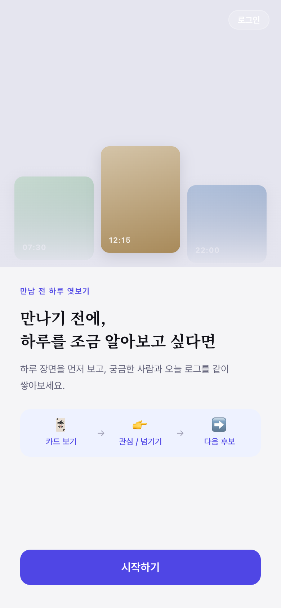
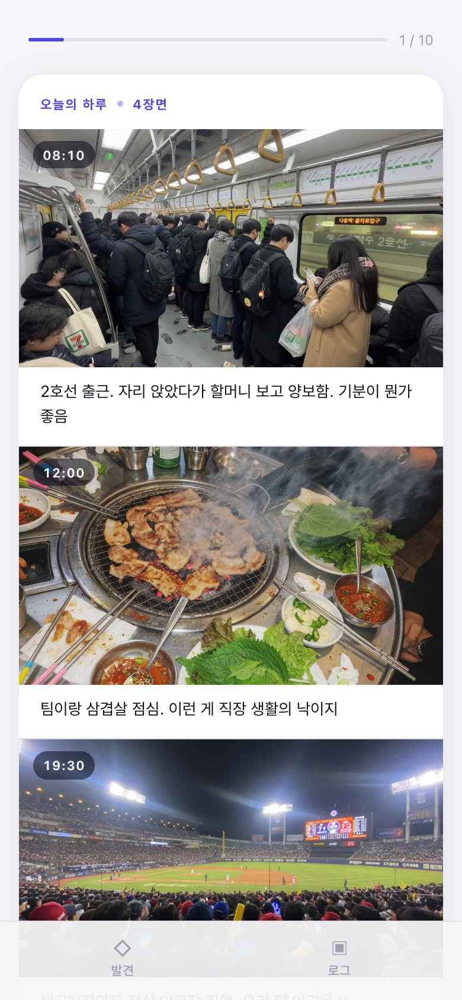
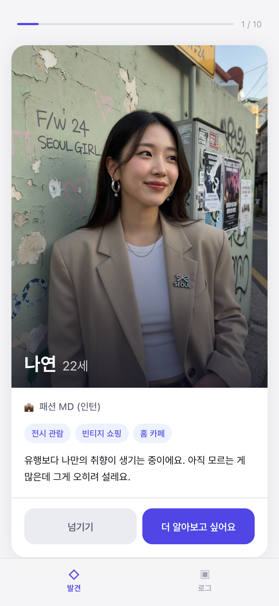
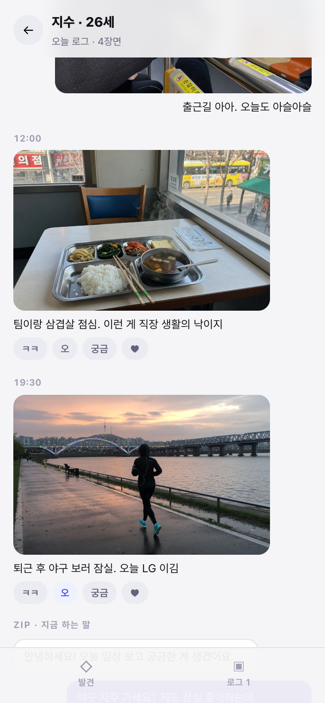

# 로그 — 하루를 먼저 보다

> 프로필보다 하루를 먼저 보면, 사람을 다르게 보게 될까요?

셋로그에서 본 방식을 소개팅 앞단에 가져온 MVP입니다. **발견**에서 평범한 하루를 먼저 보고, 궁금하면 **매칭**한 뒤, 채팅방이 아니라 **오늘 로그를 같이 쌓는 방**으로 들어갑니다.

**배포 URL:** https://client-theta-ten-88.vercel.app  
**GitHub:** https://github.com/hseo1o2/JanghyeonSeo-20260902

**추천 경로:** 시작하기 → 카드 오른쪽 스와이프(관심) → 매칭되었어요 → **오늘 로그 시작하기** → 나|상대 장면, 리액션, 지금 올리기

---

## 스크린샷

| 랜딩 | B — daily_first | A — profile_first | 로그 룸 |
|:---:|:---:|:---:|:---:|
|  |  |  |  |

---

## 아키텍처

```
Browser (Vercel)                  Server (Render)               External
┌──────────────────────┐          ┌─────────────────────────┐
│  React + Vite        │          │  Node.js + Express       │
│                      │          │                          │
│  Landing             │  POST    │  /api/experiment/start   │
│  ├─ condition 배정   │ ──────►  │  └─ sessionId 생성       │
│  └─ warmupHealth()   │          │     condition 고정       │
│                      │          │                          │
│  Experiment (A|B)    │  GET     │  /api/candidates         │
│  ├─ DailyLifeCard    │ ◄──────  │  └─ seededShuffle        │
│  └─ ProfileCard      │          │     8명 고정 순서        │
│                      │          │                          │
│  스와이프/버튼       │  POST    │  /api/events             │──► Supabase
│  └─ 관심/넘기기      │ ──────►  │  └─ 이벤트 기록          │    PostgreSQL
│                      │          │                          │
│  daily_first만:      │  POST    │  /api/candidates/:id     │
│  └─ 프로필 공개 요청 │ ──────►  │  /reveal                 │
│                      │          │                          │
│  LogRoom             │  POST    │  /api/chat               │──► OpenAI
│  ├─ 장면 타임라인    │ ◄──────  │  └─ GPT-4o-mini          │    GPT-4o-mini
│  └─ 지금 올리기      │          │     (장면·직업만 근거)   │
│                      │          │                          │
└──────────────────────┘          └─────────────────────────┘

GitHub Actions: 12분마다 /api/health ping → Render cold start 방지
client/src/main.jsx: setInterval(warmupHealth, 14분) → 클라이언트 측 보조 킵얼라이브
```

---

> **두 발견 조건 모두 보려면**
> - B (daily_first): https://client-theta-ten-88.vercel.app?condition=daily_first
> - A (profile_first): https://client-theta-ten-88.vercel.app?condition=profile_first
> - 세션 초기화: 브라우저 콘솔에서 `localStorage.clear()` 후 새로고침

> **데모 계정 (선택):** 발견 참여에 로그인은 필요 없습니다. 조건을 고정해 볼 때만 `/login`에서 `user01@demo.com` ~ `user10@demo.com` / `Demo1234` 를 쓰면 됩니다.

---

## 과제 구현에 대한 설명

제품은 설문으로 끝나지 않습니다.

`발견(A/B) → 더 알아보기/넘기기 → 매칭 → 오늘 로그 → 리액션·지금 올리기 → 장면으로 말 걸기`

### 발견 — 순서를 비교하는 실험

| 조건 | 첫 화면 | 의사결정 시점의 정보 |
|---|---|---|
| A — profile_first | 사진 · 이름 · 나이 · 직업 · 취미 · 자기소개 | 전부 공개된 상태에서 호감 여부 판단 |
| B — daily_first | 타임스탬프 일상 장면 3–4컷 (누구인지 모름) | 정체 미공개 상태에서 "더 알고 싶은지" 판단 |

같은 후보 집합, 같은 순서(`seededShuffle`). CTA 위치·텍스트·레이아웃은 같고, 카드 본체만 실험 변수입니다. 왼쪽 스와이프는 넘기기, 오른쪽은 관심입니다.

### 매칭 이후 — 셋로그식 로그

관심 표시 후 채팅으로 바로 보내지 않습니다. 셋로그의 Log(하루)와 Zip(지금 하는 말)을 빌려 이렇게 구현했습니다.

- **나 | 상대** 오늘 장면을 나란히 쌓는 분할 뷰
- 시간순 타임라인
- 상대 장면에 `ㅋㅋ` / `오` / `궁금` / `♥`
- **지금 올리기** (출근·점심·운동·밤)
- 방금 본 장면으로 말 걸기, 그리고 **실제 GPT 대화** (상대가 오늘 장면만 근거로 대답)
- 로그를 열면 상대가 오늘 장면으로 먼저 인사하고, 내가 장면을 올리면 그 장면에 반응합니다

양방향 실사용자 매칭과 실시간 채팅은 넣지 않았습니다. 상대의 말은 GPT가 오늘 장면만 근거로 역할극합니다.

하단 탭: **발견** / **로그**. 카드를 다 보면 감사 설문이 아니라 로그 목록으로 갑니다.

### 이벤트 수집 구조

유저 행동은 Supabase PostgreSQL `events` 테이블에 기록합니다.

| 이벤트 | 시점 |
|---|---|
| `candidate_viewed` | 후보 카드 로드 직후 |
| `candidate_skipped` | 넘기기 (버튼 또는 좌 스와이프) |
| `candidate_interested` | 더 알아보고 싶어요 (버튼 또는 우 스와이프) |
| `profile_revealed` | 프로필 공개 완료 (daily_first) |
| `conversation_intent_clicked` | 장면으로 말 걸기 |
| `log_posted` | 내 하루 장면 올리기 |
| `log_reacted` | 상대 장면에 리액션 |
| `chat_sent` | 로그 룸에서 상대에게 말 보내기 |

핵심 지표는 여전히 발견 단계의 **`candidate_interested / candidate_viewed`** 입니다. 로그 룸 이벤트는 그 클릭이 제품으로 이어지는지를 보는 보조 신호입니다.

### 크롤러 연결

`crawler/crawl.js`는 과제 1에서 인용한 셋로그 공개 기사와 위키/나무위키에서 **반복되는 생활 테마**(출퇴근·혼밥·운동·심야)를 뽑습니다. 문장을 그대로 붙이지 않고, 그 테마로 후보 캡션을 다시 썼습니다.

---

## 강조하고 싶은 부분

### 1. 실험 통제의 정확성

**CTA(하단 버튼)는 두 조건에서 완전히 동일합니다.** 위치·텍스트·너비 모두 같습니다. 카드 본체만 실험 변수입니다. A는 프로필 전체, B는 타임스탬프 일상 장면입니다.

조건 배정은 `Math.random()` 으로 세션 시작 시 1회 결정되고, localStorage + Supabase에 동시 고정됩니다. 새로고침·중도 이탈 후 복귀해도 조건이 바뀌지 않습니다.

### 2. 서버가 아닌 API 레벨에서의 정보 차단

`daily_first` 조건에서 "더 알아보고 싶어요"를 클릭하기 전까지는 `/api/candidates/:id/reveal` 엔드포인트를 호출하지 않습니다. 프론트에서 숨긴 게 아니라, 서버가 아예 프로필 데이터를 내려주지 않습니다. 의도적으로 설계한 정보 격리입니다.

### 3. conversation_intent_clicked 이벤트 타이밍

AI 대화 시작 버튼은 OpenAI 응답이 **성공적으로 도착한 후**에만 이벤트를 기록합니다. 네트워크 오류로 대화 목록을 받지 못한 경우 이벤트가 남지 않아 지표가 오염되지 않습니다.

### 4. 스와이프 UX — 실험 변수 오염 없이 구현

Tinder식 좌우 스와이프를 추가했지만, 버튼과 완전히 같은 핸들러(`onSkip` / `onInterest`)를 호출합니다. 입력 수단이 다를 뿐 이벤트 스키마는 동일합니다. `touch-action: pan-y`로 수직 스크롤은 유지하면서 수평 방향 제스처만 캡처합니다.

### 5. Render cold start 대응

Render 무료 티어는 15분 비활성 시 슬립합니다. 세 겹으로 줄였습니다.

- GitHub Actions가 12분마다 `/api/health`를 ping해 서버를 깨워 둡니다
- HTML 로드 시점에 health를 먼저 치고, 랜딩에서 `/start`를 미리 받아 둡니다
- `/start`가 첫 후보 카드까지 같이 내려줘서, 시작 직후 후보 API를 한 번 더 기다리지 않습니다

### 6. 데모 계정 시스템

평가자가 두 조건을 직접 체험할 수 있도록 `/login` 페이지에 10개의 데모 계정을 준비했습니다. 계정마다 강제 조건이 지정되어 있어(user01·03·07: daily_first / user02·04·08: profile_first), 조건 전환을 위해 localStorage를 수동으로 조작할 필요가 없습니다.

---

## 주요 설계 의도

### 매칭 이후를 채팅이 아니라 로그로 둔 이유

셋로그에서 본 핵심은 2초 영상 자체가 아니라, **말을 걸지 않아도 오늘의 장면이 관계를 이어 주는 시간**이었습니다. 그래서 관심 다음 화면을 1:1 채팅방이 아니라 공유 로그로 만들었습니다. 실시간 채팅·추천 알고리즘·실제 양방향 매칭은 가설을 검증하는 데 필요 없어서 빼었습니다.

### AI를 가설 밖에 둔 이유

ChatGPT는 발견 카드에 나오지 않습니다. 매칭 이후 로그 룸에서만 씁니다.

- 첫 질문 3개 생성 — 고르면 로그 룸에서 그 말로 대화가 시작됨
- 로그를 열면 상대가 오늘 장면으로 인사
- 사용자가 보낸 말에 상대가 대답 (장면·직업·취미만 근거, 성격/외모 추측 금지)
- 내가 올린 장면에 한 줄 반응
- 상대 장면에 `궁금`을 누르면 그 장면을 짚어 대답
- 나와 상대의 오늘에서 겹치는 단서가 있으면 한 줄로 짚음

AI를 발견 단계에 넣으면 가설이 오염됩니다. 그래서 흥미 표명 뒤에만 등장합니다.

### 합성 후보를 쓴 이유

매력도 편향을 제거하기 위해서입니다. 실험은 *정보 순서*의 효과를 측정하는 것이지 특정 인물의 매력을 측정하는 게 아닙니다. 10명의 후보 모두 연령(22–30), 직업, 생활 패턴을 다양하게 설계했습니다.

### Supabase를 선택한 이유

Render 무료 티어의 파일시스템은 배포·재시작마다 초기화됩니다. SQLite로 시작했다가 이 문제를 겪은 후 Supabase PostgreSQL로 전환했습니다. 이벤트 데이터가 배포 사이클에 독립적으로 유지되어야 실험 결과를 수집할 수 있습니다.

---

## 구현 과정에서 겪은 어려움과 해결 방법

### 1. Supabase 연결 — 로컬 네트워크 포트 차단

로컬 네트워크가 Supabase의 직접 PostgreSQL 포트(5432·6543)를 차단했습니다. CLI 기반 마이그레이션이 전혀 작동하지 않았고, 모든 시도가 `ETIMEDOUT`으로 끝났습니다. Supabase 대시보드 SQL 에디터로 직접 테이블을 생성하고, 이후 REST API(`@supabase/supabase-js`)로 연결을 검증했습니다.

### 2. Vercel 환경변수 누락

`VITE_API_BASE_URL`이 Vercel에 설정되지 않아 프로덕션 빌드가 `localhost:4000`으로 요청을 보냈습니다. 배포 후 API 통신이 전혀 안 되는 상태였습니다. Vercel CLI로 env 추가 후 재배포하여 해결했습니다.

### 3. Render 환경변수 누락으로 배포 실패

첫 배포 시 Supabase 키, OpenAI 키 등이 Render에 설정되지 않아 `update_failed`가 났습니다. Render REST API(`PUT /v1/services/{id}/env-vars`)로 환경변수를 일괄 설정한 후 재배포했습니다.

### 4. iOS Safari `position: fixed` 트랩

`ProfileReveal` 오버레이에 `position: fixed`를 썼는데, 부모에 `transform`이 있으면 fixed가 뷰포트가 아닌 부모 기준으로 재배치됩니다. `#root`의 `position: relative`를 제거해서 해결했습니다.

### 5. 스와이프 수직 스크롤 충돌

터치 스와이프 구현 시 `touch-action: none`으로 시작했더니 일상 카드(이미지 4장, 전체 높이 ~1200px)에서 수직 스크롤이 막혔습니다. `touch-action: pan-y`로 변경하고, `onTouchMove`에서 dx/dy 비교로 수평 제스처 여부를 먼저 판별한 후에만 스와이프 트래킹을 시작하도록 수정했습니다.

### 6. `maybeSingle()` vs `single()`

Supabase에서 `.single()`은 행이 없을 때 에러를 던집니다. 세션 조회처럼 결과가 없을 수 있는 쿼리에서 `.single()`을 쓰니 존재하지 않는 세션을 `500`이 아닌 잘못된 상태코드로 응답하고 있었습니다. `.maybeSingle()`로 교체하고 null 체크를 명시적으로 처리했습니다.

---

## 아쉬웠던 점 또는 추가로 개선하고 싶은 부분

### 실험 설계의 한계 — 호기심 공백 vs 순서 효과

현재 설계에서 B 조건의 클릭률이 높아도 두 가지로 해석됩니다.

1. **일상이 더 좋은 시작점이다** — 의도한 해석
2. **정체를 가려서 생긴 호기심 공백 때문이다** — 교란 변수

A는 이미 다 본 뒤 호감을 묻고, B는 정체를 모른 채 열어보고 싶은지 묻습니다. 버튼 텍스트는 같지만 의미가 다릅니다. 더 깨끗한 설계는 두 조건 모두 같은 정보량을 제공하고 *순서만* 바꾸는 것(A: 프로필→일상→결정, B: 일상→프로필→결정)이지만, 이번 MVP에서는 "정보 순서 차이"를 큰 틀에서 검증하는 데 집중했습니다.

### 실험 결과 미수집

실제 사용자에게 배포해 유의미한 샘플을 모을 시간이 없었습니다. 이벤트 스키마와 수집 인프라는 완성되어 있어 트래픽만 있으면 즉시 분석 가능합니다. 최소 유의 표본(조건당 n=30 이상)이 쌓이면 카이제곱 검정으로 조건 간 클릭률 차이를 검증할 수 있습니다.

### 이미지 자산

후보 프로필과 일상 장면은 캡션에 맞춰 만든 정적 이미지로 `client/public/candidates/`에 넣었습니다. 외부 CDN(picsum/randomuser)에 의존하지 않아 회색 박스가 뜨지 않습니다. 일상 컷은 정체가 바로 드러나지 않게 장면 위주로 구성했습니다.

### 로그 룸의 상대는 실사용자가 아닙니다

실제 상대가 오늘 장면을 올리는 양방향 로그는 아닙니다. 매칭 이후 GPT가 후보의 장면·직업·취미만 보고 짧게 대답하게 해서, 셋로그식 경험이 끊기지 않게 했습니다. 다음 단계라면 두 사람이 같은 방에 들어와 직접 장면을 올리는 쪽이 맞습니다.

### 성별 선호 미반영

타깃이 이성 소개팅임에도 성별 선호를 받지 않았습니다. 관심 없는 성별 카드가 분모에 들어가 `interested/viewed` 지표를 흐릴 수 있습니다.

### 통계적 유의성

현재 규모에서는 통계 검정이 의미 없습니다. 트래픽이 쌓이면 조건당 클릭률을 비교하면 됩니다.

---

## 기술 스택

| | |
|---|---|
| Frontend | React + Vite → Vercel |
| Backend | Node.js + Express → Render |
| Database | Supabase (PostgreSQL) |
| Auth | Server-side JWT (jsonwebtoken) |
| AI | OpenAI GPT-4o-mini |
| 크롤러 | Node.js + cheerio + axios |

## 로컬 실행

```bash
# 서버
cd server && npm install && npm run dev

# 클라이언트 (별도 터미널)
cd client && npm install && npm run dev
```

환경변수는 `server/.env.example`, `client/.env.example` 참고.

> 데모 계정: `user01@demo.com` ~ `user10@demo.com` / `Demo1234`
